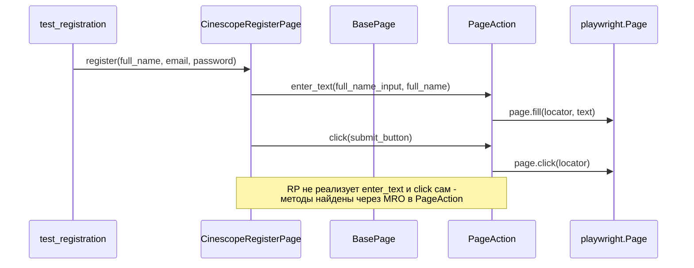
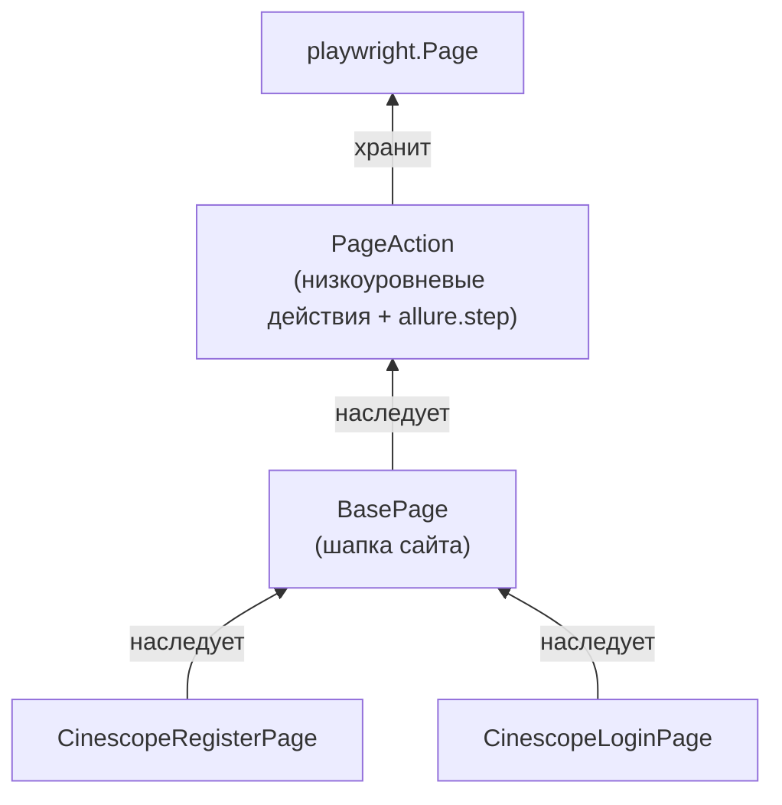

# PageObject

## Зачем нужен Page Object

В модуле 6 мы писали UI-тесты вот так:

```python
def test_registration(page: Page):
    page.goto('https://dev-cinescope.f5qa.ru/register')
    page.fill('[data-qa-id="register_full_name_input"]', 'Иван Иванов')
    page.fill('[data-qa-id="register_email_input"]', 'ivan@test.qa')
    page.fill('[data-qa-id="register_password_input"]', 'qwerty123Q')
    page.fill('[data-qa-id="register_password_repeat_input"]', 'qwerty123Q')
    page.click('[data-qa-id="register_submit_button"]')
    expect(page.get_by_text("Подтвердите свою почту")).to_be_visible()
```

Работает, но с ростом проекта у такого подхода есть цена:

- локатор `register_submit_button` живёт прямо в тесте - если фронтендеры переименуют `data-qa-id`, придётся искать и чинить его во всех тестах, которые проходят через регистрацию
- пять строк с `page.fill` придётся повторять в каждом тесте, где нужен зарегистрированный пользователь
- тест одновременно описывает *что* мы проверяем и *как именно* Playwright ищет элементы на странице - это две разные заботы, смешанные в одном месте

Мы уже решали похожую проблему в модуле 4, когда обернули HTTP-запросы в API-классы (`AuthApi`, `UserApi`). Page Object - та же идея, только для UI: детали взаимодействия со страницей выносятся в отдельный класс, а тест обращается к странице через понятные методы вместо прямых вызовов `page.fill` и `page.click`

---

## Где хранить Page Object: директория `pages/`

Так же как в модуле 4 мы завели `clients/` с одним классом на каждый раздел API, для Page Object заводим отдельную директорию `pages/` - один файл на один класс, один класс на одну страницу сайта:

```
project/
├── pages/
│   ├── actions.py
│   ├── base_page.py
│   ├── register_page.py
│   └── login_page.py
├── tests/
│   └── ui/
│       ├── test_registration.py
│       └── test_login.py
└── conftest.py
```

Держать все классы в одном файле неудобно уже на 3-4 страницах - непонятно, где заканчивается один класс и начинается другой, а `git diff` при правке одной страницы задевает файл со всеми остальными.

### Что входит в Page Object, а что нет

В классе страницы должны быть:

- локаторы элементов - как их искать
- методы, описывающие действия пользователя на странице (заполнить форму, кликнуть, дождаться редиректа)
- простые методы получения состояния страницы (текст элемента, виден ли он) - без оценки, хорошее это состояние или плохое

В классе страницы не должно быть:

- `assert` и `expect()` - решение "тест прошёл или упал" принимает тест, а не страница. Page Object только сообщает факты о странице (какой текст показан, открылся ли попап), сравнение с ожиданием - работа теста
- тестовых данных (случайные email, пароли) - их создаёт тест или фикстура и передаёт в методы страницы параметрами, как `full_name`, `email`, `password` в `register()`
- ветвления по сценариям теста (если роль ADMIN - одно, если USER - другое) - это ответственность теста
- прямых обращений к API - для этого уже есть API-классы из модуля 4, Page Object работает только через UI

<aside>
⚙

**Атомарная задача:** Добавь в `CinescopeRegisterPage` метод `assert_email_field_is_filled(self, expected_email)`, который сам внутри делает `assert self.page.input_value(self.email_input) == expected_email`. Вызови его в тесте с заведомо неверным `expected_email`. Посмотри на traceback падения - он укажет на файл в `pages/`, а не в `tests/`. Разбери, почему это усложняет поиск причины падения при чтении отчёта, и вынеси проверку обратно в тест в виде обычного `assert` или `expect()`.

</aside>

---

## `CinescopeRegisterPage`: первый класс

```python
# pages/register_page.py
from playwright.sync_api import Page

class CinescopeRegisterPage:
    def __init__(self, page: Page):
        self.page = page
        self.url = "https://dev-cinescope.f5qa.ru/register"

        self.full_name_input = '[data-qa-id="register_full_name_input"]'
        self.email_input = '[data-qa-id="register_email_input"]'
        self.password_input = '[data-qa-id="register_password_input"]'
        self.repeat_password_input = '[data-qa-id="register_password_repeat_input"]'
        self.submit_button = '[data-qa-id="register_submit_button"]'

    def open(self):
        self.page.goto(self.url)

    def register(self, full_name: str, email: str, password: str):
        self.page.fill(self.full_name_input, full_name)
        self.page.fill(self.email_input, email)
        self.page.fill(self.password_input, password)
        self.page.fill(self.repeat_password_input, password)
        self.page.click(self.submit_button)
```

Тест с этим классом:

```python
# tests/ui/test_registration.py
from random import randint

from playwright.sync_api import Page, expect

from pages.register_page import CinescopeRegisterPage

def test_registration(page: Page):
    email = f"aqatest{randint(1, 999999)}@email.qa" 
    # Для примера. Так-то уже есть фикстуры и генератор данных

    register_page = CinescopeRegisterPage(page)
    register_page.open()
    register_page.register("Иван Иванов", email, "qwerty123Q")
    # Для примера. Так-то уже есть фикстуры и генератор данных

    expect(page.get_by_text("Подтвердите свою почту")).to_be_visible()
```

Тест теперь читается как список действий пользователя. Детали локаторов из него ушли в класс. Email собирается с числовым суффиксом - без этого второй запуск теста упадёт с ошибкой о том, что пользователь уже зарегистрирован. Однако у нас уже заведены генераторы данных - лучше пользоваться, конечно же, ими.

<aside>
⚙

**Атомарная задача:** Опечатайся в `submit_button` - поменяй `register_submit_button` на `register_submit_btn`. Запусти тест и изучи `TimeoutError`, который вернёт Playwright: сколько он ждал элемент и какой селектор искал. Верни правильное значение обратно

</aside>

<aside>
🔍

**Атомарная задача (реальный баг):** Собери email с подчёркиванием, например `f"aqa_test{randint(1, 999999)}@email.qa"`, и прогони тест. Клиентская валидация (обычная проверка формата email) пропустит такой адрес, запрос уйдёт на бэкенд - и вернётся `400 Bad Request` с сообщением `Некорректный email`. Открой вкладку Network или добавь у себя лог ответа `page.on("response", ...)`, чтобы увидеть этот ответ напрямую. Это несовпадение фронтенд- и бэкенд-валидации, а не подстроенная учебная ошибка - на реальных проектах такое встречается сплошь и рядом

</aside>

---

## Проблема дублирования

Заведём вторым классом страницу логина:

```python
# pages/login_page.py
from playwright.sync_api import Page

class CinescopeLoginPage:
    def __init__(self, page: Page):
        self.page = page
        self.url = "https://dev-cinescope.f5qa.ru/login"

        # уточни реальные data-qa-id инспектором, как делали в модуле 6 - здесь для примера
        self.email_input = '[data-qa-id="login_email_input"]'
        self.password_input = '[data-qa-id="login_password_input"]'
        self.submit_button = '[data-qa-id="login_submit_button"]'

    def open(self):
        self.page.goto(self.url)

    def login(self, email: str, password: str):
        self.page.fill(self.email_input, email)
        self.page.fill(self.password_input, password)
        self.page.click(self.submit_button)
```

Уже на двух классах видно повторение: `__init__` каждый раз принимает `page`, оба класса имеют `open()`, который делает `page.goto(self.url)`. В реальном проекте страниц десятки, и у каждой есть общая шапка сайта (логотип, ссылка "Все фильмы"). Если копировать методы шапки в каждый класс, любое изменение в шапке превращается в правки по всем файлам сразу.

---

## `PageAction` и `BasePage`

Разделим ответственность на два уровня:

- `PageAction` - обёртка над низкоуровневыми действиями Playwright (клик, ввод текста). Сам по себе в тестах не используется, от него наследуются страницы
- `BasePage` - логика, общая для всех страниц сайта (переход по шапке). Наследуется от `PageAction`

Конкретные страницы (`CinescopeRegisterPage`, `CinescopeLoginPage`) наследуются от `BasePage` и получают доступ к обоим уровням.

```python
# pages/actions.py
import allure
from playwright.sync_api import Page

class PageAction:
    def __init__(self, page: Page):
        self.page = page

    @allure.step("Переход на страницу: {url}")
    def open_url(self, url: str):
        self.page.goto(url)

    @allure.step("Ввод текста в поле: {locator}")
    def enter_text(self, locator: str, text: str):
        self.page.fill(locator, text)

    @allure.step("Клик по элементу: {locator}")
    def click(self, locator: str):
        self.page.click(locator)
```

`BasePage` хранит общие для всех страниц локаторы шапки и наследует `PageAction`, чтобы пользоваться его методами:

```python
# pages/base_page.py
import allure

from pages.actions import PageAction

class BasePage(PageAction):
    def __init__(self, page):
        super().__init__(page)
        self.home_url = "https://dev-cinescope.f5qa.ru/"
        self.all_movies_link = 'a[href="/movies"]'

    @allure.step("Переход на 'Все фильмы' из шапки")
    def go_to_all_movies(self):
        self.click(self.all_movies_link)
```

`CinescopeRegisterPage` избавляется от прямых вызовов `page.fill`/`page.click` и обращается к унаследованным методам:

```python
# pages/register_page.py
from pages.base_page import BasePage

class CinescopeRegisterPage(BasePage):
    def __init__(self, page):
        super().__init__(page)
        self.url = f"{self.home_url}register"

        self.full_name_input = '[data-qa-id="register_full_name_input"]'
        self.email_input = '[data-qa-id="register_email_input"]'
        self.password_input = '[data-qa-id="register_password_input"]'
        self.repeat_password_input = '[data-qa-id="register_password_repeat_input"]'
        self.submit_button = '[data-qa-id="register_submit_button"]'

    def open(self):
        self.open_url(self.url)

    def register(self, full_name: str, email: str, password: str):
        self.enter_text(self.full_name_input, full_name)
        self.enter_text(self.email_input, email)
        self.enter_text(self.password_input, password)
        self.enter_text(self.repeat_password_input, password)
        self.click(self.submit_button)
```

Побочный эффект наследования от `PageAction` - каждый вызов `enter_text` и `click` теперь сам попадает в allure-отчёт отдельным шагом, хотя в самом `register()` про allure ни слова

Цепочка вызовов при регистрации:



А структура наследования - так:



<aside>
⚙

**Атомарная задача:** Убери строку `super().__init__(page)` из `CinescopeRegisterPage.__init__`. Запусти тест и изучи `AttributeError` - разбери, какого атрибута не хватает и почему он пропал именно из-за пропущенного вызова `super().__init__`. Верни строку обратно.

</aside>

<aside>
🐛

**Задача на дебаггер:** Поставь breakpoint в трёх местах - `PageAction.click`, `BasePage.go_to_all_movies` и `CinescopeRegisterPage.register`. Прогони `test_registration` через дебаггер и на каждом breakpoint вызови в консоли дебаггера `id(self.page)`. Убедись, что во всех трёх классах это один и тот же объект `Page`, а не три разных - именно поэтому изменения, сделанные в `PageAction`, видны во всех страницах, которые от него наследуются.

</aside>

---

## Фикстуры для Page Object

В модуле 6 фикстура `page` уже открывает браузер, контекст и вкладку. Остаётся обернуть создание Page Object в свою фикстуру, чтобы тест получал уже готовый, открытый объект страницы:

```python
# conftest.py
import pytest
from playwright.sync_api import Page

from pages.register_page import CinescopeRegisterPage

@pytest.fixture
def register_page(page: Page) -> CinescopeRegisterPage:
    register_page = CinescopeRegisterPage(page)
    register_page.open()
    return register_page
```

Тест сокращается до:

```python
# tests/ui/test_registration.py
from random import randint

import allure
import pytest
from playwright.sync_api import expect

@allure.epic("Тестирование UI")
@allure.feature("Регистрация")
@pytest.mark.ui
class TestRegistration:
    @allure.title("Успешная регистрация нового пользователя")
    def test_registration(self, register_page, page):
        email = f"aqatest{randint(1, 999999)}@email.qa"
        register_page.register("Иван Иванов", email, "qwerty123Q")
        expect(page.get_by_text("Подтвердите свою почту")).to_be_visible()
```

У фикстуры `register_page` не указан `scope` - значит, `scope="function"` по умолчанию: новый объект страницы на каждый тест. Это не случайность: `Page` хранит состояние конкретной вкладки браузера (текущий URL, введённые в поля значения, открытые попапы). Если два теста получат один и тот же `Page` из сессионной фикстуры, второй тест начнёт работу с того состояния, в котором её оставил первый - в отличие от `ApiManager` из модуля 4, где общая `session` на весь прогон была осознанным решением.

<aside>
⚙

**Атомарная задача:** Смени `register_page` на `scope="session"` и добавь второй тест регистрации, использующий ту же фикстуру. Запусти оба теста подряд и разбери, на чём падает второй тест - он получит страницу, уже отправленную на `/login` первым тестом, а не свежую `/register`. Верни `scope` по умолчанию.

</aside>

---

## 🧪 Практика

<aside>
📋

Реализуй `CinescopeLoginPage` по той же схеме, что и `CinescopeRegisterPage`:

1. Класс наследуется от `BasePage`, локаторы - `data-qa-id` полей email/пароля и кнопки входа, найденные инспектором на `https://dev-cinescope.f5qa.ru/login`
2. Заведи фикстуру `login_page`, аналогичную `register_page` (без явного `scope`, страница уже открыта)
3. Напиши `test_login`, который логинится ранее зарегистрированным пользователем и проверяет редирект на главную страницу и появление уведомления об успешном входе
4. Оформи тест так же, как регистрацию - `allure.epic`/`allure.feature`/`allure.title` и `pytest.mark.ui`

Критерии успеха: `pytest -m ui -v` показывает оба теста пройденными, а allure-отчёт показывает шаги переходов и вводов внутри каждого теста без единого `allure.step` в самом тесте.

</aside>